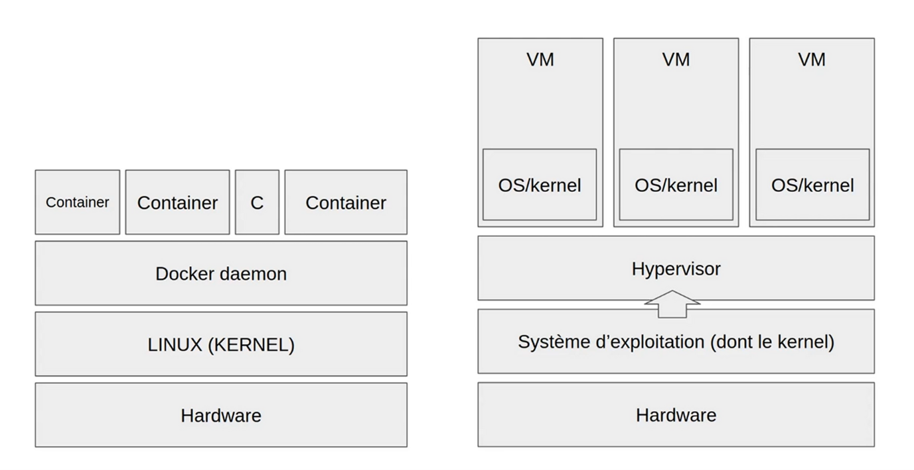
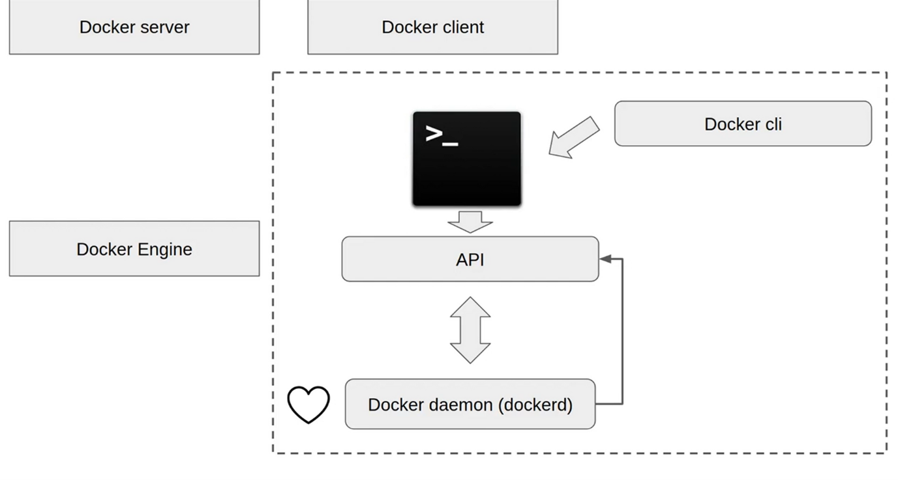
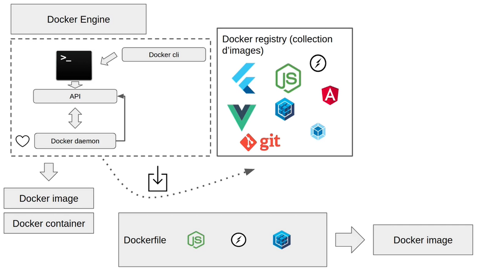

# Notes bases docker

*Ces notes ont pour objectif de servir de mémo de la formation Dyma Docker*

## Pourquoi faire ?

- Simplifier l’installation d’une application
- - Définit un environnement dans une image pour la faire tourner partout
- Simplifier le déploiement
- - Puisque tout est définit à l’avance dans l’image : pas de soucis !
- Réduire les couts
- - Mettre l’app dans un container permet de faire tourner plusieurs fois l’application de manière indépendante sur le même serveur ce qui fait que même si une app crash, les utilisateurs ont encore accès au service.
- - Permet d’avoir besoin de moins de serveurs aussi

## Fonctionnement

Schéma explicatif de l'interet de docker vs les VMs :

=> Chaque VM embarque son système d'exploitation ce qui fait beaucoup de fichiers dupliqués qui prennent de la place à terme.  
=> Si l'on veut installer ou updater un programme sur toutes les VMs, il faut le faire cas pas cas à la main VS une seule fois sur Docker

## Ecosystème

Schéma de la base d l'écosystème Docker :

- Le docker daemon est le coeur de Docker.
- - Interractions possibles via l'API
- - Mise à disposition d'un CLI pour simplifier l'affaire
- - Il construit les images et lance les containers
- - Il accède au registry pour rechercher des images toutes faites (node, ect)

## Dockerfile

### Outil pour créer des images  
- Dans 99% des cas on part d'une image pré-existante (image de base) qu'on vient modifier / ajouter des actions
- Le dockerfile est interprété de haut en bas et une image intermédiaire est crée à chaque ligne jusqu'à l'image finale. Pourquoi ?
- - Pour pouvoir créer un container intermédiaire dans lequel executer ce qu'on a à éxecuter car une image ne peut pas executer de commandes.
- Le dockerfile est lié à un contexte : le dossier dans lequel il est.
- - On pourra descendre dans des sous dossier mais jamais remonter hors du contexte
- On peut aussi créer une image depuis un container (alors que normalement c'est l'inverse !) - mais peu utile
- - On peut utiliser `docker container commit`

*L'ordre des instructions est important. En effet, si on rebuild une image déjà buildé, docker va utilisé le cache et donc être ultra rapide. Dès qu'il tombe sur une ligne dans laquelle un changement a eu lieu, le cache va être invalidé et tout va être refait à parti de là.*

### Instructions: Dockerfile
- **FROM**
- **RUN** 
- **COPY / ADD**
- - On préfère utiliser COPY
- **CMD / ENTRYPOINT**
- - La différence ?
- - CMD peut etre overridé par l'appel de l'image par une autre fonction
- - ENTRYPOINT bloque la fonction de lancement
- **WORKDIR**
- **ARG**
- - On définit des variables qu'on assigne à l'appel docker et qui auront donc cette valeur partout 
- **ENV**
- - Comme ARG mais qu'on récupère ensuite dans le container
- **LABEL**
- - Permet de stocker des infos sur l'image qu'on pourra inspecter via `docker image inspect ID_IMAGE`

## Docker Hub

hub.docker.com   
`docker login` pour se log en console

**Récupérer une image**
- `docker image pull node`
- - Permet de récupérer l'image de node sur docker hub
- - Mais fait automatiquement si on fait un node run et que node n'est pas une de nos images locale 

**Publier une image**
- Créer un répertoire comme sur github par ex 
- `docker image push ID_IMAGE` 

**Technique de partage alternative**
- Plutôt que d'utiliser docker hub, on peut créer un fichier tar, grace à `docker image save`  
- On peut ensuite la lancer sur une autre machine via `docker image load`
- De même avec `docker container export` puis `docker image import` mais cette fois pour copier un container en particulier, par ex pour le tester

## Persistance

Il arrive qu'on lance un container et qu'au cours de sa vie, certaines modifications lui aient été apportées.   
Problème : quand on fait un `docker container prune`, on perd toutes ces modifications... 3 solutions :
- **Volumes (solution à priorisé)**
- - Ce qu'on écrit dans un container est en fait mis dans un volume par docker qui lui persiste même si le container disparait
- - On peut le partager entre plusieurs containers. Les modifs faites dans l'un sera enregistrée sur le volume et donc effective dans l'autre aussi.
- -  `Docker run --mount type=volumne, source=VOLUME_NAME, target=PATH ID_IMAGE` - on lie le container qu'on créer à un volume
- - Permet de ne pas avoir à se soucier des path contrairement aux bind mount

- **Bind mount**
- - On peut monter un fichier directement sur notre container.
- - ce qu'on écrit dans le container se retrouve sur ce fichier lié et vice versa
- - `Docker run --mount type=bind, source=URL, target=URL ID_IMAGE` - la source doit être absolute

- **TMPFS**
- - temporary files system : on stocke l'info sur la RAM 

## Réseaux

- **Bridge** (par défaut)
- - Docker peut gérer plusieurs réseaux locaux qui peuvent ensuite accéder au web.
- - On peut grouper des containers sur un réseau, ou en mettre hors réseau.
- **Host**
- - Chaque container a une adresse IP locale gérée par le router -> Docker n'aura pas la main
- - Fonctionne uniquement sous linux
- **Overlay**
- - Permet de faire communiquer des réseaux de différents docker deamons ensemble via docker swarm

On utilise pas l'adresse IP des containeurs pour communiquer car on ne la connait pas toujours et elle peut changer.  
On peut utiliser `--link` pour lier un container à un autre et le choper sur le réseau grace à son nom (mais pénible).  

=> On peut éviter ces problèmes en créant nos propres réseaux ce qui nous permet d'utiliser des DNS  

## Docker compose

**Problème** :  
Quand on lance un container, on doit à chaque fois lui définir des ports, volumes, réseau, envrionnement, ect ect puis le lancer via un gigantesque docker run  
=> Les possibilités de faire une erreur sont légions. Et ce pour chaque container qui constituent notre application.  

**Solution**:  
- Chaque container de notre application est appelé service
- Docker compose nous permettra de gérer tous ces service à un seul endroit
- - Utilise un docker-compose.yml qui nous permettra de tout paramétrer et lancer

Ex de docker-compose.yml: [docker-compose.yml](/tp3/docker-compose.yml)

- On peut préciser un contexte pour le cas où nous avons plusieurs applications dans le même dossier

### Commandes

**Executer un fichier docker-compose.yml** (lance tous les containers définits)
- `docker-compose up` 

**Lancer juste un container**
- `docker-compose run ID_CONTAINER_YML` 

**Stopper tous les containers compose**
- `docker-compose down` 

## Commandes de base

**Lister les containers**
- `Docker ps` (container en cours)
- `Docker ps -a` (all)

**Comparer l'état à l'état de lancement**
- `Docker container diff ID_CONTAINER`

**Accéder au terminal d'un container en execution**
- `Docker container attach ID_CONTAINER`

**Lancer un container**
- `Docker container start ID_CONTAINER` (simple)
- `Docker container start -ai ID_CONTAINER` (avec accès terminal)

**Renommer un container**
- `Docker container rename ID_CONTAINER NEW_NAME`

**Créer un container**
- `Docker container create IMAGE_NAME` (simple)
- `Docker container create -it IMAGE_NAME` (permet accès terminal)

**Supprimer tous les containers**
- `Docker container prune`

**Supprimer tous les images**
- `Docker image prune`

**Supprimer tous les containers et images**
- `Docker system prune`

**Voir processus en cours sur un container**
- `Docker container top ID_CONTAINER`

**Transférer fichier local - container**
- `Docker container cp LOCAL_FILE ID_CONTAINER:TARGET_PATH`

**Stopper un container**
- `Docker container stop ID_CONTAINER`
- `Docker container kill ID_CONTAINER` (plus violent)

**Créer une image custom**
- `Docker build -t IMAGE_NAME:IMAGE_VERSION PATH_TO_DOCKERFILE`
- - Par convention le nom est de la forme utilisateur/répertoire:version

**Voir les logs d'un container**
- `Docker container logs ID_CONTAINER`
- `Docker container logs -f ID_CONTAINER` pour se maintenir sur les logs 

**Voir l'historique des modifs sur l'image**
- `Docker image history ID_CONTAINER`

**Lancer une image**
- `Docker run ID_IMAGE`
Mais si on veut y accéder depuis notre navigateur, il peut y avoir beosin de brancher le port de notre ordi sur le port du container :
- `Docker run -p PORT_HOST:PORT_CONTAINER ID_IMAGE`
En effet, les flux sortant sont autorisés sur les containers, mais les entrant bloqués par défaut.

**Voir les networks**
- `Docker network ls`

**Voir le détail d'un network** (permet de trouver par ex l'adresse d'un container)
- `Docker network inspect NOM_CONTAINER`

**Créer un network**
- `Docker network create NAME`

**Lancer un container sur un network**
- `docker run --network NETWORK_NAME --name DNS_NAME ID_IMAGE`

**Lancer un container sur un network host**
- `docker run --network host ID_IMAGE`

**Lancer un container hors réseau**
- `docker run --network none ID_IMAGE`

**Connecter un container à un network**
- `docker network connect NETWORK CONTAINER`

## Lexique

**Namespace**: espaces isolés sur un système Linux  
**Cgroups**: control groups - permet de limiter l'accès des processus aux ressources  
**Kernel**: noyau du système qui gère la répartition des capacités du hardware  
**Hypervisor**: chef d'orchestre qui répartit les ressources à plusieurs VM  
**Une Node**: groupement de plusieurs container qui échanges des données  
